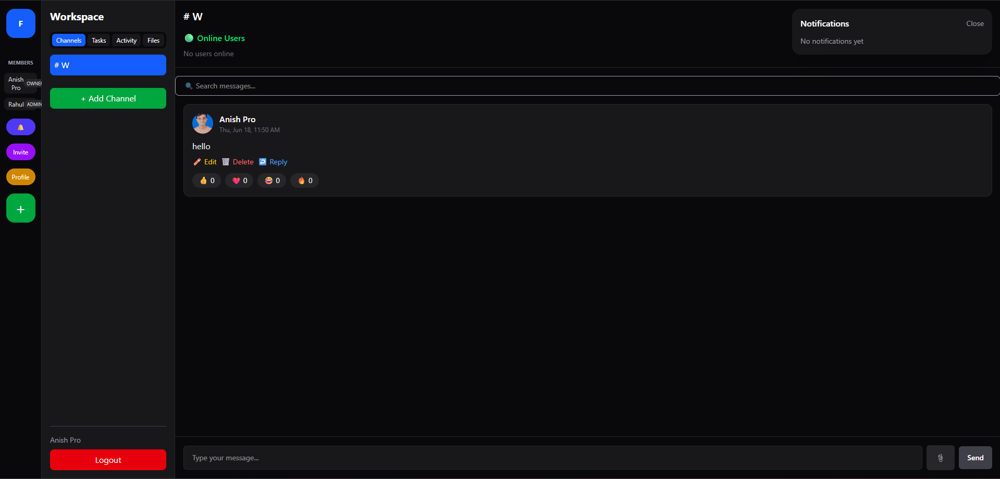
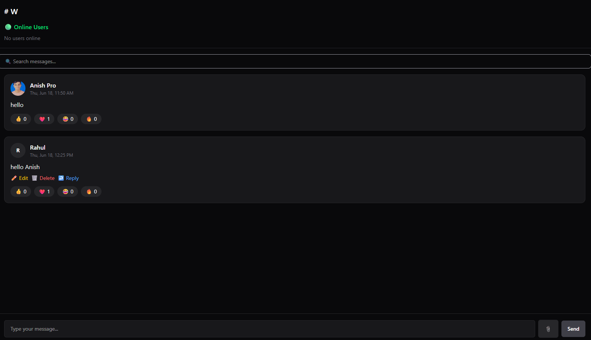
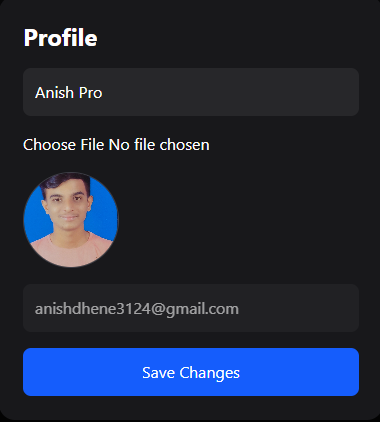
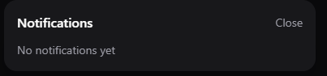
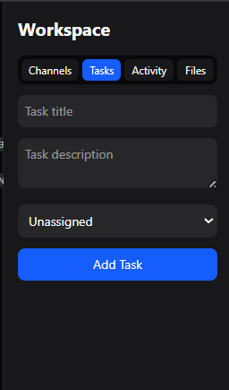
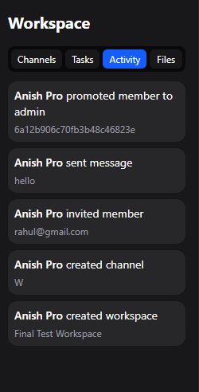
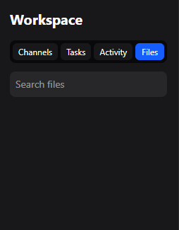

# Real-Time Collaboration Platform

Built using MERN Stack and Socket.IO.

## Features

* JWT Authentication
* Workspaces and Channels
* Real-time Messaging
* Online Users
* Typing Indicator
* File Sharing
* Message Reactions
* Reply System
* Edit/Delete Messages
* Search Messages
* Role-Based Access Control
* Notifications
* Task Module
* Activity Module

## Tech Stack

### Frontend

* React.js
* Tailwind CSS
* Axios
* Socket.IO Client

### Backend

* Node.js
* Express.js
* MongoDB
* Mongoose
* Socket.IO
* JWT
* Multer

## Installation

### Backend

```bash
cd server
npm install
npm run dev
```

### Frontend

```bash
cd client
npm install
npm run dev
```

# Screenshots

## Workspace Dashboard



## Chat Interface



## Profile Management



## Notifications Panel



## Task Module



## Activity Logs



## File Management

